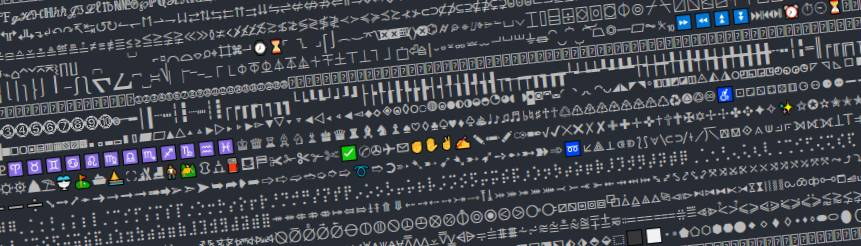

# CharCodes




A tiny program that prints all the UTF-16 characters into a file 'output.txt'.

This repo can also be used as a template for a new project. It comes configured with [tsx](https://github.com/esbuild-kit/tsx), [ESLint](https://eslint.org/) and [Prettier](https://prettier.io/).

## Installation

```bash
$ git clone https://github.com/DigitalNaut/charcodes.git && cd charcodes && npm i
```

## Usage

```bash
$ npm print
```

## License

[MIT](LICENSE)
